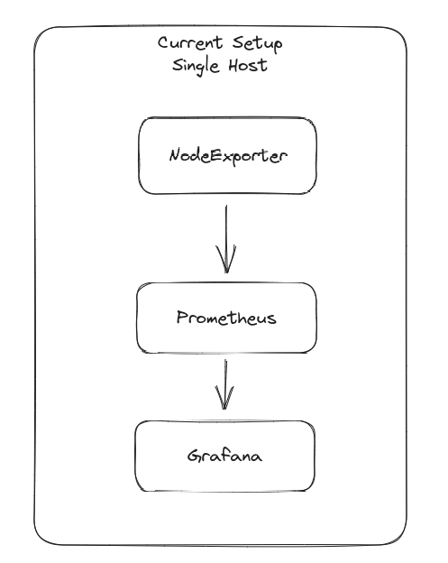
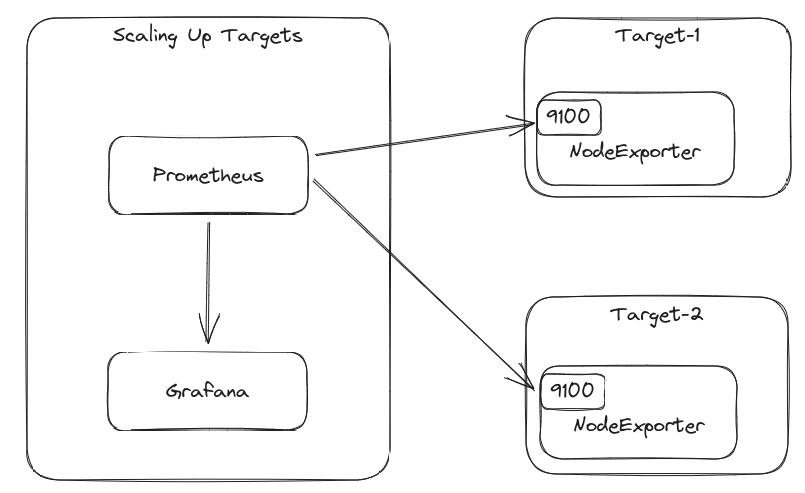

{}
The components are made up of docker containers run on AWS EC2 instances
{}

## Start Here

These are dashboards that can be made in Grafana once Prometheus, Node Exporter and Cadvisor are working

[Host Metrics Dashboard Example](http://ec2-184-72-10-163.us-west-1.compute.amazonaws.com:3000/d/e1cbc5fc-b664-475f-92a7-3599eb48329e/docker-host?orgId=1&refresh=10s)

[Container Dashboard Example](http://ec2-184-72-10-163.us-west-1.compute.amazonaws.com:3000/d/e852703f-4c62-46fa-8ecb-5e9b7fabbe68/monitor-services?orgId=1&refresh=10s)

## Architecture

This is a basic implementation of monitor and monitored systems on the same host.

This is how this basic architecture can be used to scale.

