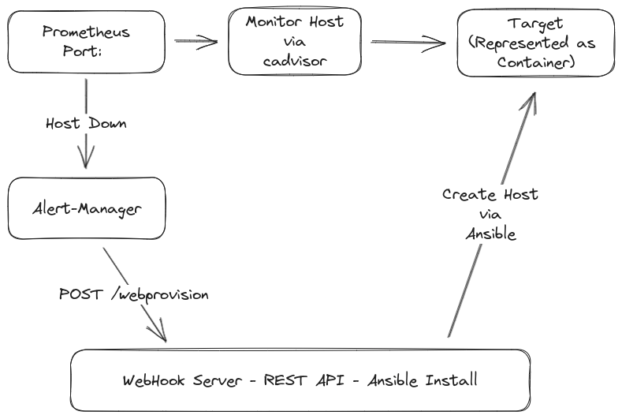

{}
Due to time and resource constraints, this was tested on docker
{}




## github 

[Github source](https://github.com/sedillo/health-monitor)

## Alerts

There are two types of alerts defined, the first in case cadvisor has not seen target-1 before, the second for the contain going down once cadvisor has been run.
```yaml
  - alert: ContainerDown
    expr: absent(container_last_seen{name="target-1"})
    for: 1m
    labels:
      severity: critical
    annotations:
      summary: "Docker container is down"
  - alert: ContainerNeverUp
    expr: container_last_seen{name="target-1"} > 60
    for: 1m
    labels:
      severity: critical
    annotations:
      summary: "Docker container is down"
```


This is an example services stack written for docker compose

```yaml
services:
  prometheus:
    image: prom/prometheus:latest
    container_name: prometheus
    volumes:
      - ./prometheus:/etc/prometheus
      - prometheus_data:/prometheus
    command:
      - '--config.file=/etc/prometheus/prometheus.yml'
      - '--storage.tsdb.path=/prometheus'
      - '--web.console.libraries=/etc/prometheus/console_libraries'
      - '--web.console.templates=/etc/prometheus/consoles'
      - '--storage.tsdb.retention.time=200h'
      - '--web.enable-lifecycle'
    restart: unless-stopped
    ports:
      - "9090:9090"
    networks:
      - healnet

  alertmanager:
    image: prom/alertmanager:latest
    container_name: alertmanager
    volumes:
      - ./alertmanager:/etc/alertmanager
    command:
      - '--config.file=/etc/alertmanager/config.yml'
      - '--storage.path=/alertmanager'
    restart: unless-stopped
    ports:
      - "9093:9093"
    networks:
      - healnet

  cadvisor:
    image: gcr.io/cadvisor/cadvisor:latest
    container_name: cadvisor
    privileged: true
    devices:
      - /dev/kmsg:/dev/kmsg
    volumes:
      - /:/rootfs:ro
      - /var/run:/var/run:ro
      - /sys:/sys:ro
      - /var/lib/docker:/var/lib/docker:ro
      #- /cgroup:/cgroup:ro #doesn't work on MacOS only for Linux
    restart: unless-stopped
    ports:
      - "8080:8080"
    networks:
      - healnet

  webhooks:
    container_name: webhooks
    build:
      context: .
      dockerfile: Dockerfile.webhooks
    volumes:
      - ./webhooks:/app
      - /var/run/docker.sock:/var/run/docker.sock
    networks:
      - healnet
    ports:
      - "5000:5000"
```
